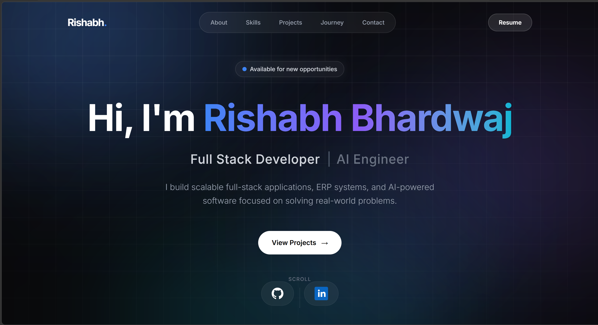

# 🌐 Rishabh Bhardwaj — Developer Portfolio

A modern, responsive developer portfolio showcasing my projects, technical skills, experience, and journey as a software developer.

Built with **React + Vite** and deployed on **Vercel**.

**[🚀 Live Demo](https://rishabh-portfolio-lac.vercel.app/)**



## 🛠️ Tech Stack


## ✨ Features

* Responsive design for mobile, tablet, and desktop
* Smooth scroll animations and micro-interactions
* Project showcase with live demos and source code
* Skills and technology overview
* Interactive experience timeline
* One-click resume download
* Contact section
* Dark modern UI
* Fast performance with Vite

## 📂 Project Structure

```text
rishabh-portfolio/
├── public/                 # Static public assets
├── src/
│   ├── assets/             # Images, resume, and icons
│   ├── components/         # Reusable UI components
│   ├── data/               # Projects, skills, and other data
│   ├── pages/              # Page-level components
│   ├── sections/           # Portfolio sections
│   ├── App.jsx             # Root component
│   ├── App.css             # App-level styles
│   ├── index.css           # Global styles
│   └── main.jsx            # Application entry point
├── index.html              # HTML entry point
├── package.json            # Project dependencies and scripts
├── package-lock.json
├── tailwind.config.js      # Tailwind CSS configuration
├── postcss.config.js       # PostCSS configuration
├── vite.config.js          # Vite configuration
├── .oxlintrc.json          # Linting configuration
├── .gitignore
└── README.md
```

## ⚙️ Setup & Links

### Run Locally

**Prerequisites:** Node.js v18+ and npm

```bash
# Clone the repository
git clone https://github.com/rishabhbhardwaj-dev/rishabh-portfolio.git

# Navigate to the project
cd rishabh-portfolio

# Install dependencies
npm install

# Start the development server
npm run dev
```

The development server will start locally, and Vite will provide the local URL in your terminal.

### Connect With Me

* **Portfolio:** [rishabh-portfolio-lac.vercel.app](https://rishabh-portfolio-lac.vercel.app/)
* **GitHub:** [@rishabhbhardwaj-dev](https://github.com/rishabhbhardwaj-dev)
* **LinkedIn:** [Rishabh Bhardwaj](https://www.linkedin.com/in/rishabhbhardwaj-tech/)

## 📄 License

This project is created and maintained by **Rishabh Bhardwaj**.
